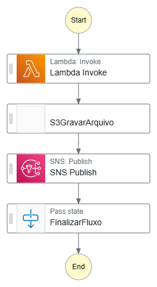

# Desafio AWS Step Functions - Projeto DIO

## Introdução

Este repositório contém anotações e insights adquiridos durante a prática com **AWS Step Functions**. O objetivo é consolidar workflows automatizados e documentar o aprendizado de forma clara para estudo.

---

## Resumo sobre Step Functions

**AWS Step Functions** é um serviço de orquestração que permite criar workflows visuais e automatizados. Ele organiza **tarefas** (Tasks) e **estados** (States) em fluxos que podem incluir chamadas a Lambda, S3, EC2 e outros.

Principais conceitos:
- **States**: Cada passo do fluxo, podendo ser do tipo `Task`, `Pass`, `Choice`, `Wait` ou `Fail`.
- **Task**: Estado que executa uma ação, como chamar uma função Lambda ou escrever em S3.
- **Pass**: Estado que apenas passa dados adiante, útil para testes ou fluxos iniciais.
- **Retry**: Permite configurar tentativas automáticas em caso de falha de uma Task.
- **OutputPath/InputPath**: Controla quais dados entram e saem de cada estado.
- **Visual Workflow**: Gráfico gerado automaticamente que ajuda a entender e documentar o fluxo.

Step Functions ajuda a reduzir complexidade, criar fluxo e integrar serviços da AWS de forma organizada.

---

## Meu Fluxo Simples

Para este laboratório, criei um **fluxo simples** que integra **Lambda**, **S3** e **SNS**. 

